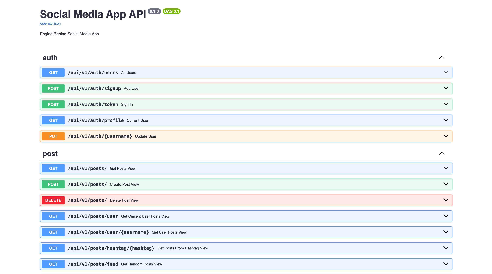

# FastAPI Social Media API

This project is a **Social Media API service** built using **FastAPI** and **SQLite**. The API allows users to register, create posts, comment on posts, and like/unlike posts.

## Features

- **User Registration**: Users can sign up and log in using JWT for authentication.
- **Post Management**: Users can create, edit, and delete posts.
- **Commenting System**: Users can comment on posts, edit, and delete their comments.
- **Like/Unlike Posts**: Users can like and unlike posts.
- **Listing**: All users and posts can be listed.

## Technology Stack

- **Backend**: FastAPI
- **Database**: SQLite
- **Authentication**: JWT (JSON Web Tokens)
- **Server**: Uvicorn

## Requirements

Before running the project, make sure you have the following installed:

- **Python 3.8+**
- **FastAPI**
- **Uvicorn**
- **SQLite** (bundled with Python)

## Installation

Follow the steps below to set up and run the project on your local machine.

1. Clone the repository:

   ```bash
   git clone https://github.com/SametKoleoglu/Social-Media-App-API-With-FastAPI.git
   cd Social-Media-App-API-With-FastAPI

2. Create and activate a virtual environment:
   
   ```bash
   python -m venv venv
   source venv/bin/activate  # For Windows: venv\Scripts\activate

3. Install the dependencies:
   
   ```bash
   pip install -r requirements.txt

4. Set up the database (SQLite):

   FastAPI automatically sets up the SQLite database. You can configure the database connection in the database.py file.

 


5. Run the FastAPI server:

   bash
   uvicorn src.main:app --reload
   
   The API will be accessible at: http://127.0.0.1:8000


Screenshots
Here are some screenshots of the API in action:
